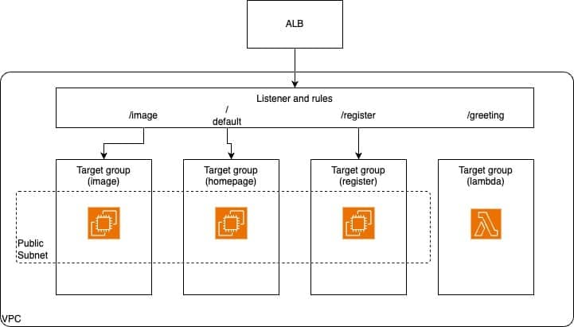

# AWS ALB with Terraform

Terraform to manage ALB in AWS via Terraform. Integrating EC2 and Lambdas with ALB, re-route traffic to different ec2 or lambds basd on reqeusts url.

1. Configure EC2 instances
2. Create an ALB Target Group
3. Add the ALB Target Group attachment
4. Create an ALB Listener
5. Manage custom ALB Listener rules
6. Test the path-based routing on ALB
7. Integrate ALB with AWS Lambda
8. Integrate ALB with AWS Web Application Firewall
